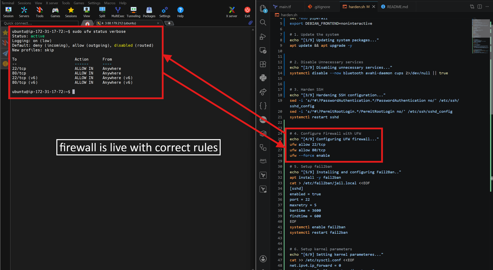
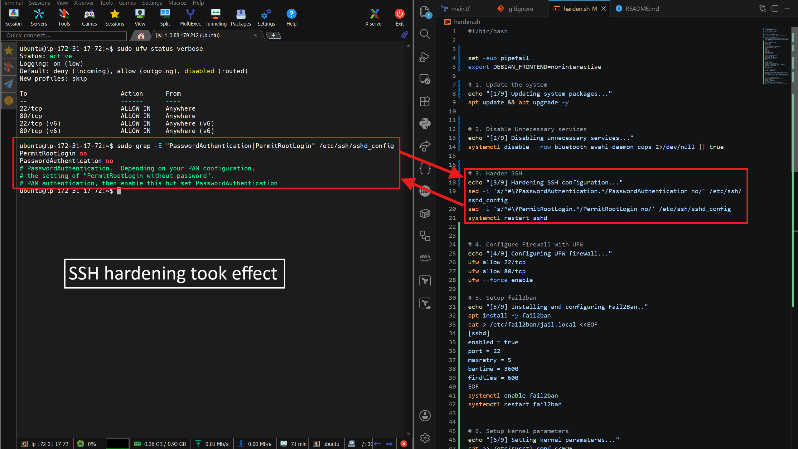
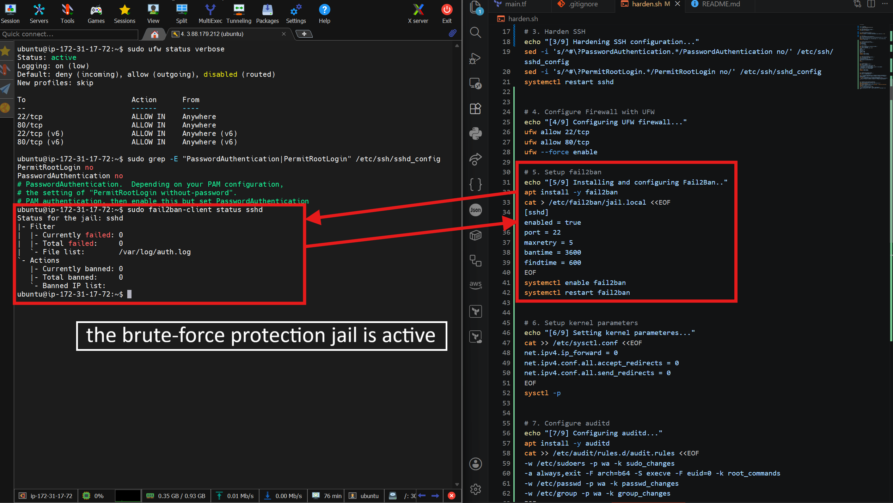
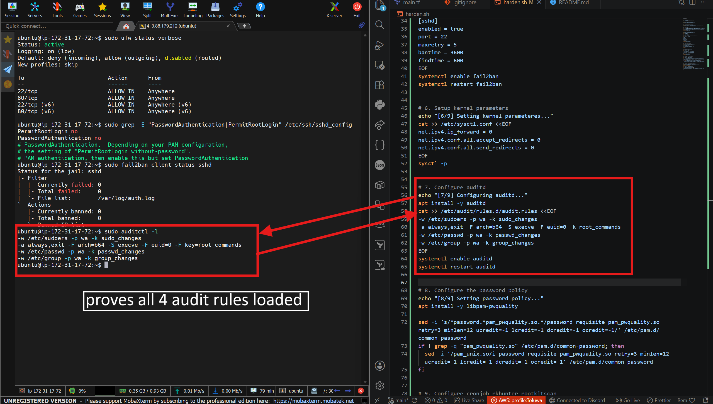

# Bash Scripting for Server Hardening

**Automated Linux server hardening with a single Bash script. Covers SSH lockdown, firewall, brute force protection, kernel security, auditing, password policy, and rootkit scanning. Provisioned on AWS with Terraform.**

## What This Does

1. Provisions an EC2 instance with Terraform, including a freshly generated SSH key pair
2. Updates all system packages to their latest versions
3. Disables unnecessary services (Bluetooth, Avahi, CUPS) to reduce attack surface
4. Hardens SSH by disabling password authentication and root login entirely
5. Configures UFW firewall to allow only SSH and HTTP traffic
6. Installs and configures Fail2Ban to auto ban IPs after repeated failed SSH attempts
7. Sets kernel parameters to disable IP forwarding and ICMP redirects
8. Configures auditd to log sudo usage and changes to sudoers, passwd, and group files
9. Enforces a strong password policy (12 character minimum, mixed case, digit, special character)
10. Sets up a daily cron job to run an rkhunter rootkit scan and report results

## The Problem

Without hardening:
- A fresh server ships with default settings that assume a trusted environment, not the open internet
- Password based SSH login means brute force bots can attempt logins indefinitely
- No firewall means every port is reachable by default
- Failed login attempts go unnoticed, with no automatic response
- Privilege escalation and file tampering leave no audit trail
- Rootkits and hidden malware can persist undetected

With this setup:
- SSH is locked to key only auth, root login is blocked entirely
- UFW restricts traffic to only the ports the server actually needs
- Fail2Ban automatically blocks IPs after repeated failed login attempts
- Every sudo command and change to critical system files is logged
- Password policy enforces real complexity requirements system wide
- A daily automated scan checks for rootkit signatures

## What Gets Created

- **EC2 Instance** - Ubuntu 22.04 t2.micro, provisioned via Terraform
- **SSH Key Pair** - generated by Terraform and saved locally for access
- **Security Group** - allows only SSH (22) and HTTP (80)
- **harden.sh** - the hardening script, covering all 9 steps below
- **UFW Firewall Rules** - restrict inbound traffic to SSH and HTTP only
- **Fail2Ban Jail** - bans an IP after 5 failed SSH attempts within 10 minutes, for 1 hour
- **Kernel Parameters** - IP forwarding and ICMP redirects disabled via sysctl
- **auditd Rules** - watches /etc/sudoers, /etc/passwd, /etc/group, and all commands run as root
- **PAM Password Policy** - 12 character minimum with uppercase, lowercase, digit, and special character required
- **rkhunter Cron Job** - daily rootkit scan at 3 AM, results delivered to local mail

### Infrastructure Verification

#### UFW Firewall Rules

<h3>UFW active with only SSH and HTTP allowed, all other inbound traffic denied by default.</h3>

#### SSH Hardening Configuration

<h3>sshd_config confirming password authentication and root login are both disabled.</h3>

#### Fail2Ban Jail Status

<h3>Fail2Ban sshd jail active and monitoring auth.log for failed login attempts.</h3>

#### auditd Rules Loaded

<h3>All four audit rules loaded, tracking sudoers changes, root command execution, and passwd/group file changes.</h3>

## How to Use

1. Clone this repo
2. Run terraform init
3. Run terraform plan to preview resources
4. Run terraform apply to provision the EC2 instance
5. SSH into the instance using the generated hardening-key.pem and the ubuntu user
6. Copy harden.sh onto the server
7. Run sudo bash harden.sh
8. Follow any interactive prompts during package installation (Postfix mail configuration, select "Local only")
9. Verify hardening using the commands below

sudo ufw status verbose
sudo grep -E "PasswordAuthentication|PermitRootLogin" /etc/ssh/sshd_config
sudo fail2ban-client status sshd
sudo auditctl -l

**Note:** The rkhunter cron job delivers scan results via local mail (/var/mail/root), not real email. In production, this would be routed through SES or an SMTP relay for actual delivery.

## Tools Used

- Terraform
- AWS EC2
- Bash
- UFW
- Fail2Ban
- auditd
- PAM
- rkhunter
- cron

## Files

- `main.tf` - provisions EC2 instance, SSH key pair, and security group
- `harden.sh` - the full 9 step hardening script